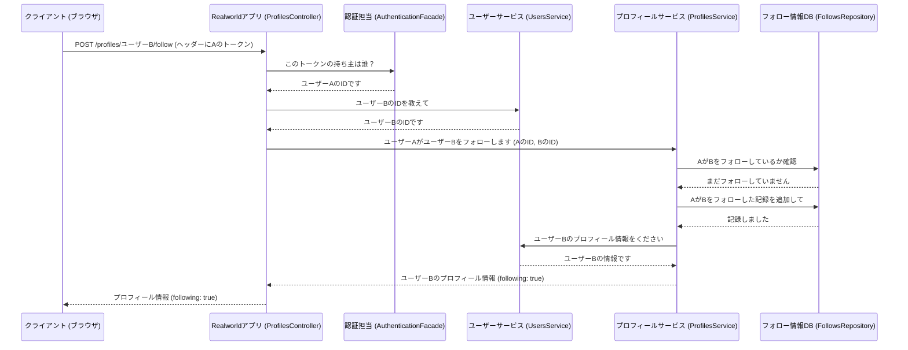

# Chapter 2: プロフィール管理 (プロフィールかんり)

前の章、[ユーザー管理と認証 (ユーザーかんりと にんしょう)](01_ユーザー管理と認証.md)では、ユーザーがどのようにアプリケーションに登録し、ログインするかを学びました。この章では、そのユーザーたちが互いに関わり合うための「プロフィール管理」機能について見ていきましょう。

## プロフィール管理ってなに？

ソーシャルメディアやブログサイトを使ったことがあるなら、他の人のプロフィールページを見たり、「フォロー」ボタンを押したりした経験があるでしょう。プロフィール管理は、まさにそのような機能を提供します。

このアプリケーションでは、以下のことができます。

*   **他のユーザーのプロフィールを見る**: ユーザー名、自己紹介文（Bio）、プロフィール画像などを表示します。
*   **ユーザーをフォローする**: 気になるユーザーをフォローして、その人の活動（例えば、新しい記事の投稿）を追いやすくします。
*   **ユーザーのフォローを解除する**: フォローをやめます。

これを学校のクラスに例えてみましょう。

*   **プロフィール**: クラス名簿に載っている、あなたの友達の情報（名前、ちょっとした自己紹介）です。
*   **フォローする**: 特定の友達に「注目する」こと。「あの人が何か面白いことをしたら知りたいな」と思う感じです。
*   **フォロー状態**: あなたが誰に注目していて、誰があなたに注目しているかの記録です。

この機能の中心は、「誰が誰をフォローしているか」という関係性を記録し、リクエストに応じてユーザーの基本情報とそのフォロー状態を組み合わせて表示することです。

## どうやって使うの？ (APIエンドポイント)

プロフィール関連の機能は、以下のAPIエンドポイントを通じて利用します。

### 1. プロフィール情報を取得 (`GET /profiles/{username}`)

特定のユーザーのプロフィール情報を取得します。 `{username}` の部分には、情報を取得したいユーザーのユーザー名を入れます。

**リクエスト例:**

`GET /profiles/ユーザーB`

（もしあなたがログインしている場合、リクエストヘッダーにあなたのトークンを含めます。これにより、あなたがそのユーザーをフォローしているかどうかの情報も付加されます。）

```
Authorization: Token あなたのトークン...
```

**レスポンス例 (出力):**

ユーザーBのプロフィール情報が返されます。もしあなたがログインしていてユーザーBをフォローしている場合、`following` は `true` になります。

```json
{
  "profile": {
    "username": "ユーザーB",
    "bio": "ユーザーBの自己紹介です。",
    "image": "http://example.com/userB.png",
    "following": true // あなたがユーザーBをフォローしているか
  }
}
```

**関連コード (コントローラー):**

`ProfilesController.java` の `getProfile` メソッドがこのリクエストを処理します。

```java
// src/main/java/com/marcusmonteirodesouza/realworld/api/profiles/controllers/ProfilesController.java
@GetMapping("/{username}")
public ProfileResponse getProfile(@PathVariable String username) {
    // 1. ユーザー名からユーザー情報を取得 (UsersServiceを使用)
    var user = usersService.getUserByUsername(username).orElse(null);
    // ... (ユーザーが見つからない場合のエラー処理) ...

    // 2. ログイン中のユーザーIDを取得 (もしログインしていれば)
    var authenticatedUserId = authenticationFacade.getAuthentication().getName();

    // 3. プロフィール情報とフォロー状態を取得 (ProfilesServiceを使用)
    var profile = profilesService.getProfile(
        user.getId(), // 見たいプロフィールのユーザーID
        Optional.ofNullable(authenticatedUserId) // ログイン中のユーザーID (いなければnull)
    );

    // 4. レスポンスを作成して返す
    return new ProfileResponse(profile);
}
```

1.  まず、`UsersService`（[ユーザー管理と認証 (ユーザーかんりと にんしょう)](01_ユーザー管理と認証__ユーザーかんりと_にんしょう__.md)で触れたサービス）を使って、指定されたユーザー名のユーザー情報を探します。
2.  次に、リクエストを送ってきた人が誰なのか（ログインしているか）を確認します。
3.  `ProfilesService`（プロフィール関連の処理を担当するサービス）に、ユーザー情報と「誰が見ているか」の情報を渡し、最終的なプロフィール情報（フォロー状態を含む）を組み立ててもらいます。
4.  最後に、`ProfileResponse` という形式でクライアントに返します。

### 2. ユーザーをフォローする (`POST /profiles/{username}/follow`)

特定のユーザーをフォローします。この操作には認証（ログインしてトークンを持っていること）が必要です。

**リクエスト例:**

`POST /profiles/ユーザーB/follow`

リクエストヘッダーにあなたのトークンを含める必要があります。

```
Authorization: Token あなたのトークン...
```

**レスポンス例 (出力):**

フォロー操作後のユーザーBのプロフィール情報が返されます。`following` は `true` になります。

```json
{
  "profile": {
    "username": "ユーザーB",
    "bio": "ユーザーBの自己紹介です。",
    "image": "http://example.com/userB.png",
    "following": true // フォローが成功した
  }
}
```

**関連コード (コントローラー):**

`ProfilesController.java` の `followUser` メソッドが担当します。

```java
// src/main/java/com/marcusmonteirodesouza/realworld/api/profiles/controllers/ProfilesController.java
@PostMapping("/{username}/follow")
@Transactional // データベース操作を伴うため
public ProfileResponse followUser(@PathVariable String username) {
    // 1. ユーザー名からフォローされるユーザー情報を取得
    var userToFollow = usersService.getUserByUsername(username).orElse(null);
    // ... (ユーザーが見つからない場合のエラー処理) ...

    // 2. ログイン中のユーザーID（フォロワー）を取得
    var followerId = authenticationFacade.getAuthentication().getName();

    // 3. フォロー処理を実行 (ProfilesServiceを使用)
    profilesService.followUser(followerId, userToFollow.getId());

    // 4. 更新されたプロフィール情報を取得して返す
    var profile = profilesService.getProfile(
        userToFollow.getId(), Optional.of(followerId));

    return new ProfileResponse(profile);
}
```

1.  フォローしたい相手のユーザー情報を取得します。
2.  リクエストヘッダーのトークンから、誰がフォローしようとしているのか（フォロワーのID）を取得します。
3.  `ProfilesService` にフォロワーのIDとフォローされる相手のIDを渡し、フォローを実行するよう依頼します。
4.  最後に、フォロー状態が更新されたプロフィール情報を返します。

### 3. ユーザーのフォローを解除する (`DELETE /profiles/{username}/follow`)

特定のユーザーのフォローを解除します。これも認証が必要です。

**リクエスト例:**

`DELETE /profiles/ユーザーB/follow`

リクエストヘッダーにあなたのトークンを含める必要があります。

```
Authorization: Token あなたのトークン...
```

**レスポンス例 (出力):**

フォロー解除操作後のユーザーBのプロフィール情報が返されます。`following` は `false` になります。

```json
{
  "profile": {
    "username": "ユーザーB",
    "bio": "ユーザーBの自己紹介です。",
    "image": "http://example.com/userB.png",
    "following": false // フォローが解除された
  }
}
```

**関連コード (コントローラー):**

`ProfilesController.java` の `unfollowUser` メソッドが担当します。

```java
// src/main/java/com/marcusmonteirodesouza/realworld/api/profiles/controllers/ProfilesController.java
@DeleteMapping("/{username}/follow")
@Transactional // データベース操作を伴うため
public ProfileResponse unfollowUser(@PathVariable String username) {
    // 1. ユーザー名からフォロー解除されるユーザー情報を取得
    var userToUnfollow = usersService.getUserByUsername(username).orElse(null);
    // ... (ユーザーが見つからない場合のエラー処理) ...

    // 2. ログイン中のユーザーID（フォロワー）を取得
    var followerId = authenticationFacade.getAuthentication().getName();

    // 3. フォロー解除処理を実行 (ProfilesServiceを使用)
    profilesService.unfollowUser(followerId, userToUnfollow.getId());

    // 4. 更新されたプロフィール情報を取得して返す
    var profile = profilesService.getProfile(
        userToUnfollow.getId(), Optional.of(followerId));

    return new ProfileResponse(profile);
}
```

処理の流れは `followUser` とほぼ同じですが、ステップ3で `profilesService.unfollowUser` を呼び出してフォロー解除を依頼する点が異なります。

### 共通のデータ構造

APIレスポンスで使われるデータ構造も見てみましょう。

`ProfileResponse.java`: APIレスポンス全体の形式です。

```java
// src/main/java/com/marcusmonteirodesouza/realworld/api/profiles/controllers/dto/ProfileResponse.java
public final class ProfileResponse {
    private final ProfileResponseProfile profile; // ネストされたプロフィール情報

    public ProfileResponse(Profile profile) {
        this.profile = new ProfileResponseProfile(profile);
    }
    // ... ゲッター ...
}
```

`ProfileResponseProfile.java`: 実際に返されるプロフィール情報の詳細です。

```java
// src/main/java/com/marcusmonteirodesouza/realworld/api/profiles/controllers/dto/ProfileResponse.java
public static final class ProfileResponseProfile {
    private final String username;
    private final String bio;
    private final String image;
    private final Boolean following; // フォロー状態

    // アプリケーション内部のProfileオブジェクトから必要な情報を抜き出す
    public ProfileResponseProfile(Profile profile) {
        this.username = profile.getUsername();
        this.bio = profile.getBio().orElse(null); // Optionalはnullに変換
        this.image = profile.getImage().orElse(null); // Optionalはnullに変換
        this.following = profile.getFollowing();
    }
    // ... ゲッター ...
}
```

`Profile.java`: アプリケーション内部でプロフィール情報を扱うためのクラスです。ユーザー情報 (`User`) とフォロー状態 (`following`) を保持します。

```java
// src/main/java/com/marcusmonteirodesouza/realworld/api/profiles/models/Profile.java
public class Profile {
    // ... (userId, username, bio, image のフィールド) ...
    private final Boolean following; // フォロー状態

    // コンストラクタ
    public Profile(User user, Boolean following) {
        this(user.getId(), user.getUsername(), user.getBio(), user.getImage(), following);
    }
    // ... ゲッター ...
}
```

## 内部の仕組み: フォロー関係の管理

プロフィール情報の表示自体は、[ユーザー管理と認証 (ユーザーかんりと にんしょう)](01_ユーザー管理と認証__ユーザーかんりと_にんしょう__.md)で取得したユーザー情報を利用します。この章で重要なのは、「フォロー」というユーザー間の関係性をどのように管理しているかです。

### 処理の流れ (ユーザーAがユーザーBをフォローする場合)



1.  **クライアント** が、ユーザーBをフォローするリクエストを、ユーザーAのトークン付きで送信します。
2.  **Realworldアプリ (ProfilesController)** がリクエストを受け取ります。
3.  **認証担当 (AuthenticationFacade)** がトークンを検証し、リクエスト主がユーザーAであることを確認します。
4.  **ユーザーサービス (UsersService)** を使って、フォローされる相手（ユーザーB）のIDを調べます。
5.  **プロフィールサービス (ProfilesService)** に、「ユーザーAがユーザーBをフォローする」という処理を依頼します。
6.  **プロフィールサービス** は、まず **フォロー情報DB (FollowsRepository)** に問い合わせて、既にフォロー済みでないか確認します。
7.  まだフォローしていなければ、**フォロー情報DB** に「ユーザーAがユーザーBをフォローした」という新しい記録を追加するよう依頼します。
8.  フォロー記録が追加された後、**プロフィールサービス** は再度ユーザーBの情報を取得し、「following: true」という情報と共にプロフィールデータを組み立てます。
9.  **Realworldアプリ** は、組み立てられたプロフィール情報をクライアントに返します。

### `Follow.java`: フォロー情報の形

フォロー関係は、データベースのテーブルに保存されます。そのテーブルの1行分を表すのが `Follow` クラスです。

```java
// src/main/java/com/marcusmonteirodesouza/realworld/api/profiles/models/Follow.java
@Entity // データベースのテーブルに対応するクラス
@Table(uniqueConstraints = {@UniqueConstraint(columnNames = {"followerId", "followedId"})}) // followerとfollowedの組み合わせは重複しない
public class Follow {
    @Id // 主キー
    @GeneratedValue(strategy = GenerationType.UUID) // IDは自動生成
    private String id;

    @NotBlank private String followerId; // フォローする人のID

    @NotBlank private String followedId; // フォローされる人のID

    @CreationTimestamp private Timestamp createdAt; // フォローした日時

    // ... ゲッターとセッター ...
}
```

このクラスは、データベースの `Follow` テーブルの構造を定義しています。重要なのは `followerId` と `followedId` で、これにより「誰が」「誰を」フォローしているかが記録されます。`@UniqueConstraint` により、同じ人が同じ人を二度フォローすることはできません。

### `FollowsRepository.java`: データベースとの対話役

`Follow` テーブルへのデータの保存、検索、削除は `FollowsRepository` が担当します。これは [データアクセス層 (データアクセスそう)](04_データアクセス層__データアクセスそう__.md) の一部です。

```java
// src/main/java/com/marcusmonteirodesouza/realworld/api/profiles/repositories/FollowsRepository.java
// JpaRepositoryを継承することで、基本的なDB操作が使えるようになる
public interface FollowsRepository extends JpaRepository<Follow, String> {
    // followerIdとfollowedIdでフォローが存在するか確認
    Boolean existsByFollowerIdAndFollowedId(String followerId, String followedId);

    // 特定の人がフォローしている人を全て検索
    List<Follow> findByFollowerId(String followerId);

    // followerIdとfollowedIdでフォロー記録を削除
    void deleteByFollowerIdAndFollowedId(String followerId, String followedId);
}
```

`JpaRepository` を使うことで、`save` (保存) や `delete` (削除) といった基本的なデータベース操作のコードを自分で書く必要がなくなります。さらに、`existsBy...` や `findBy...`, `deleteBy...` のような命名規則に従うだけで、Spring Data JPAが自動的に適切なデータベース問い合わせ（SQL）を生成してくれます。

### `ProfilesService.java`: プロフィールとフォローのロジック担当

`ProfilesController` からの指示を受けて、実際のプロフィール情報の組み立てやフォロー/フォロー解除の処理を行うのが `ProfilesService` です。

```java
// src/main/java/com/marcusmonteirodesouza/realworld/api/profiles/services/ProfilesService.java
@Service
public class ProfilesService {
    private final UsersService usersService;         // ユーザー情報を取得するため
    private final FollowsRepository followsRepository; // フォロー情報をDB操作するため

    // コンストラクタで依存性を注入
    public ProfilesService(UsersService usersService, FollowsRepository followsRepository) {
        this.usersService = usersService;
        this.followsRepository = followsRepository;
    }

    // プロフィール情報を取得するメソッド
    public Profile getProfile(String userId, Optional<String> followerId) {
        // 1. 対象ユーザーの情報を取得
        var user = usersService.getUserById(userId).orElseThrow(/* エラー処理 */);

        // 2. 見ている人がいる場合、フォローしているか確認
        boolean following = followerId.isPresent() &&
            isFollowing(followerId.get(), user.getId());

        // 3. User情報とフォロー状態を組み合わせてProfileを返す
        return new Profile(user, following);
    }

    // フォロー処理
    public void followUser(String followerId, String followedId) {
        // 既にフォロー済みなら何もしない
        if (isFollowing(followerId, followedId)) {
            return;
        }
        // ... (follower, followedユーザーが存在するかチェック) ...

        // Followオブジェクトを作成
        var follow = new Follow();
        follow.setFollowerId(followerId);
        follow.setFollowedId(followedId);

        // DBに保存
        this.followsRepository.save(follow);
    }

    // フォロー解除処理
    public void unfollowUser(String followerId, String followedId) {
        // フォローしていなければ何もしない
        if (!isFollowing(followerId, followedId)) {
            return;
        }
        // DBから削除
        followsRepository.deleteByFollowerIdAndFollowedId(followerId, followedId);
    }

    // 指定した2者間のフォローが存在するかチェックするヘルパーメソッド
    private Boolean isFollowing(String followerId, String followedId) {
        return this.followsRepository.existsByFollowerIdAndFollowedId(followerId, followedId);
    }
}
```

*   `getProfile`: `UsersService` からユーザー基本情報を、`followsRepository` (内部の `isFollowing` メソッド経由) からフォロー状態を取得し、`Profile` オブジェクトを組み立てます。
*   `followUser`: `isFollowing` でチェック後、問題なければ新しい `Follow` オブジェクトを作成し、`followsRepository.save` でデータベースに保存します。
*   `unfollowUser`: `isFollowing` でチェック後、フォロー関係が存在すれば `followsRepository.deleteByFollowerIdAndFollowedId` でデータベースから削除します。
*   `isFollowing`: `followsRepository.existsByFollowerIdAndFollowedId` を呼び出して、データベースに該当するフォロー記録が存在するかどうかを確認します。

このように、`ProfilesService` は `UsersService` と `FollowsRepository` を協調させて、プロフィール管理機能を実現しています。

## まとめ

この章では、Realworldバックエンドアプリケーションにおけるプロフィール管理機能を学びました。

*   ユーザーは他のユーザーのプロフィール (`/profiles/{username}`) を見ることができます。
*   ログインしているユーザーは、他のユーザーをフォロー (`/profiles/{username}/follow`) したり、フォロー解除 (`/profiles/{username}/follow`) したりできます。
*   プロフィール情報には、ユーザーの基本情報（ユーザー名、Bio、画像）に加えて、リクエストしたユーザーがそのプロフィールユーザーをフォローしているかどうかの情報 (`following`) が含まれます。
*   フォロー関係は、データベースの `Follow` テーブルに `followerId` と `followedId` のペアとして保存されます。
*   `ProfilesController` がAPIリクエストを受け付け、`ProfilesService` がユーザー情報とフォロー情報の取得・更新ロジックを担当し、`FollowsRepository` がデータベースとのやり取りを行います。

これで、ユーザー同士がどのように繋がり、互いの情報を見ることができるのかがわかりました。

次の章では、このアプリケーションの中心的な機能である[記事管理 (きじかんり)](03_記事管理__きじかんり__.md)について詳しく見ていきます。ユーザーがどのように記事を作成し、他のユーザーの記事を読んだり、お気に入りに追加したりするのかを学びましょう。

---

Generated by [AI Codebase Knowledge Builder](https://github.com/The-Pocket/Tutorial-Codebase-Knowledge)