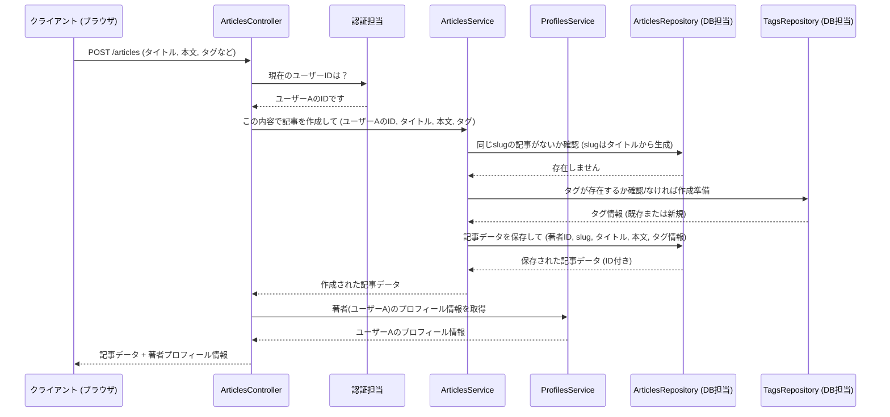

# Chapter 3: 記事管理 (きじかんり)

前の章、[プロフィール管理 (プロフィールかんり)](02_プロフィール管理.md)では、ユーザー同士がどのように繋がり、互いの情報を見ることができるかを学びました。この章では、いよいよこのアプリケーションの中心的なコンテンツである「記事」の管理機能について詳しく見ていきましょう。

## 記事管理ってなに？

このRealworldアプリケーションは、ブログプラットフォームのようなものです。ユーザーは自分の考えや情報を「記事」として投稿し、他のユーザーはその記事を読んだり、コメントしたり、お気に入りに登録したりできます。

「記事管理」は、これらの記事に関するすべての操作を担当します。具体的には、

*   **記事を作る (Create)**: 新しいブログ記事を投稿します。
*   **記事を読む (Read)**: 特定の記事や記事の一覧を表示します。
*   **記事を更新する (Update)**: 既存の記事の内容を編集します。
*   **記事を削除する (Delete)**: 不要になった記事を削除します。

これら基本的な操作（CRUD）に加えて、記事には以下のような関連機能もあります。

*   **コメント**: 記事に対して意見や感想を書き込めます。
*   **お気に入り登録**: 気に入った記事をブックマークのように登録できます。
*   **タグ付け**: 記事にキーワード（タグ）を付けて分類しやすくします。

これを図書館に例えてみましょう。

*   **記事 (Article)**: 図書館にある一冊の本です。タイトル、内容、著者（投稿者）がいます。
*   **記事作成**: 新しい本を図書館に寄贈することです。
*   **記事閲覧**: 本を手に取って読むことです。
*   **記事更新**: 本の内容を改訂することです。
*   **記事削除**: 本を図書館から除籍することです。
*   **コメント**: 本の巻末にある読者カードに感想を書くようなものです。
*   **お気に入り**: 読み返したい本を自分の「お気に入りリスト」に入れることです。
*   **タグ**: 本棚のジャンル分けラベル（例：「小説」「科学」「歴史」）のようなものです。

この章では、これらの記事に関連する機能がどのようにAPIとして提供され、内部でどのようにデータが扱われているのかを学びます。

## どうやって使うの？ (APIエンドポイント)

記事管理機能は、多くのAPIエンドポイントを通じて提供されます。いくつか主要なものを見ていきましょう。

### 1. 新しい記事を作成 (`POST /articles`)

ログインしているユーザーが新しい記事を投稿するための機能です。タイトル、概要、本文、そしてオプションでタグリストを指定します。

**リクエスト例 (入力):**

```json
{
  "article": {
    "title": "新しい記事のタイトル",
    "description": "この記事の簡単な説明",
    "body": "これが記事の本文です。",
    "tagList": ["プログラミング", "初心者向け"]
  }
}
```

**レスポンス例 (出力):**

作成された記事の詳細情報が返されます。著者情報（プロフィール）も含まれます。

```json
{
  "article": {
    "slug": "atarashii-kiji-no-taitoru", // 自動生成された記事のID（URL用）
    "title": "新しい記事のタイトル",
    "description": "この記事の簡単な説明",
    "body": "これが記事の本文です。",
    "tagList": ["プログラミング", "初心者向け"],
    "createdAt": "2023-10-27T10:00:00.000Z",
    "updatedAt": "2023-10-27T10:00:00.000Z",
    "favorited": false, // あなたはこの記事をお気に入り登録していない
    "favoritesCount": 0, // お気に入り登録数
    "author": { // 著者情報
      "username": "あなたのユーザー名",
      "bio": "あなたの自己紹介",
      "image": "あなたの画像URL",
      "following": false // あなたは自分自身をフォローできない
    }
  }
}
```

**関連コード (コントローラー):**

`ArticlesController.java` の `createArticle` メソッドが担当します。

```java
// src/main/java/com/marcusmonteirodesouza/realworld/api/articles/controllers/ArticlesController.java
@PostMapping() // POST /articles へのリクエストを処理
@ResponseStatus(HttpStatus.CREATED) // 成功時のHTTPステータスは 201 Created
@Transactional // データベース操作を含む
public ArticleResponse createArticle(@RequestBody CreateArticleRequest request)
        throws AlreadyExistsException {
    // 認証情報から現在のユーザーIDを取得
    var maybeUserId = Optional.of(authenticationFacade.getAuthentication().getName());

    // ArticlesService を使って記事を作成
    var article = articlesService.createArticle(/* リクエスト情報とユーザーID */);

    // 著者のプロフィール情報を ProfilesService で取得
    var authorProfile = profilesService.getProfile(article.getAuthorId(), maybeUserId);

    // レスポンス形式に変換して返す
    return new ArticleResponse(maybeUserId, article, authorProfile);
}
```

1.  `@PostMapping()`: `/articles` へのPOSTリクエストをこのメソッドで処理します。
2.  `authenticationFacade`: [ユーザー管理と認証 (ユーザーかんりと にんしょう)](01_ユーザー管理と認証__ユーザーかんりと_にんしょう__.md) で説明したように、現在のログインユーザーIDを取得します。
3.  `articlesService.createArticle()`: 記事作成の主要なロジックを実行します（詳細は後述）。
4.  `profilesService.getProfile()`: [プロフィール管理 (プロフィールかんり)](02_プロフィール管理__プロフィールかんり__.md) で学んだサービスを使って、著者情報を取得します。
5.  `ArticleResponse`: レスポンス用のデータ構造に変換して返します。

### 2. 記事を取得 (`GET /articles/{slug}`)

特定の記事の詳細を取得します。`{slug}` の部分には、記事固有の識別子（通常はタイトルをURLに適した形にしたもの）が入ります。

**リクエスト例:**

`GET /articles/atarashii-kiji-no-taitoru`

（ログインしている場合は、トークンをヘッダーに含めることで、自分がその記事をお気に入り登録しているかどうかの情報 (`favorited`) が正しく反映されます。）

**レスポンス例 (出力):**

記事作成時と同様の形式で、指定された記事の詳細情報が返されます。

**関連コード (コントローラー):**

`ArticlesController.java` の `getArticle` メソッドが担当します。

```java
// src/main/java/com/marcusmonteirodesouza/realworld/api/articles/controllers/ArticlesController.java
@GetMapping("/{slug}") // GET /articles/{slug} へのリクエストを処理
public ArticleResponse getArticle(@PathVariable String slug) {
    // ログインユーザーIDを取得 (ログインしていなくても可)
    var maybeUserId = Optional.ofNullable(authenticationFacade.getAuthentication().getName());

    // ArticlesService を使って slug から記事を取得
    var article = articlesService.getArticleBySlug(slug).orElse(null);

    // 記事が見つからない場合は NotFoundException を投げる
    if (article == null) {
        throw new NotFoundException(/* ... エラーメッセージ ... */);
    }

    // 著者のプロフィール情報を取得
    var authorProfile = profilesService.getProfile(article.getAuthorId(), maybeUserId);

    // レスポンス形式に変換して返す
    return new ArticleResponse(maybeUserId, article, authorProfile);
}
```

`getArticleBySlug` メソッドを使って、URLの `{slug}` に一致する記事を探します。見つかれば、著者情報を付加して返します。

### 3. 記事一覧を取得 (`GET /articles`)

条件を指定して記事の一覧を取得します。タグ、著者、お気に入り登録者などで絞り込むことができます。

**リクエスト例:**

`GET /articles?tag=プログラミング&limit=10&offset=0`
（「プログラミング」タグが付いた記事を、最新のものから10件取得）

**レスポンス例 (出力):**

複数の記事情報を含む配列が返されます。

```json
{
  "articles": [
    { // 記事1の情報
      "slug": "...", "title": "...", // ... (各記事の詳細)
      "author": { ... }
    },
    { // 記事2の情報
      "slug": "...", "title": "...", // ... (各記事の詳細)
      "author": { ... }
    }
    // ... (指定された件数分の記事)
  ],
  "articlesCount": 50 // 条件に合う記事の総数
}
```
(注: このプロジェクトの実装では `articlesCount` は返されません。クライアント側で配列の長さを見ることになります。)

**関連コード (コントローラー):**

`ArticlesController.java` の `listArticles` メソッドが担当します。

```java
// src/main/java/com/marcusmonteirodesouza/realworld/api/articles/controllers/ArticlesController.java
@GetMapping() // GET /articles へのリクエストを処理
public MultipleArticlesResponse listArticles(
        @RequestParam(required = false) String tag,    // タグ (任意)
        @RequestParam(required = false) String author, // 著者名 (任意)
        @RequestParam(required = false) String favorited, // お気に入り登録者名 (任意)
        @RequestParam(defaultValue = "20") Integer limit, // 取得件数 (デフォルト20)
        @RequestParam(defaultValue = "0") Integer offset) { // 開始位置 (デフォルト0)
    var maybeUserId = Optional.ofNullable(authenticationFacade.getAuthentication().getName());

    // ArticlesService を使って条件に合う記事リストを取得
    var articles = articlesService.listArticles(/* 検索条件 */);

    // 各記事について、著者情報を取得し、レスポンス形式に変換
    var articleResponses = articles.stream()
            .map(article -> {
                var authorProfile = profilesService.getProfile(/* ... */);
                return new ArticleResponse.ArticleResponseArticle(/* ... */);
            })
            .collect(Collectors.toList());

    // 複数記事用のレスポンス形式で返す
    return new MultipleArticlesResponse(articleResponses);
}
```

`@RequestParam` を使って、URLクエリパラメータ（`?tag=...` など）を受け取ります。これらの条件を `articlesService.listArticles` に渡して記事リストを取得し、それぞれの記事に著者情報を付加して返します。

### 4. 記事をお気に入り登録 (`POST /articles/{slug}/favorite`)

特定の記事をお気に入りリストに追加します。認証が必要です。

**リクエスト例:**

`POST /articles/atarashii-kiji-no-taitoru/favorite`
（ヘッダーにあなたのトークンが必要）

**レスポンス例 (出力):**

お気に入り登録後の記事情報が返されます。`favorited` が `true` になり、`favoritesCount` が1増えます。

```json
{
  "article": {
    // ... (記事情報) ...
    "favorited": true,
    "favoritesCount": 1,
    "author": { ... }
  }
}
```

**関連コード (コントローラー):**

`ArticlesController.java` の `favoriteArticle` メソッドが担当します。

```java
// src/main/java/com/marcusmonteirodesouza/realworld/api/articles/controllers/ArticlesController.java
@PostMapping("/{slug}/favorite") // POST /articles/{slug}/favorite を処理
@Transactional // データベース操作を含む
public ArticleResponse favoriteArticle(@PathVariable String slug) {
    var maybeUserId = Optional.of(authenticationFacade.getAuthentication().getName());
    var article = articlesService.getArticleBySlug(slug).orElse(null);
    // ... (記事が見つからない場合のエラー処理) ...

    // ArticlesService を使ってお気に入り登録処理を実行
    article = articlesService.favoriteArticle(maybeUserId.get(), article.getId());

    // 著者のプロフィール情報を取得
    var authorProfile = profilesService.getProfile(article.getAuthorId(), maybeUserId);

    // 更新された記事情報をレスポンスとして返す
    return new ArticleResponse(maybeUserId, article, authorProfile);
}
```

`articlesService.favoriteArticle` を呼び出して、指定されたユーザーが指定された記事をお気に入り登録する処理を行います。

### 5. 記事へのコメント追加 (`POST /articles/{slug}/comments`)

特定の記事にコメントを投稿します。認証が必要です。

**リクエスト例 (入力):**

`POST /articles/atarashii-kiji-no-taitoru/comments`
（ヘッダーにあなたのトークンが必要）

```json
{
  "comment": {
    "body": "この記事、とても参考になりました！"
  }
}
```

**レスポンス例 (出力):**

投稿されたコメントの情報が返されます。

```json
{
  "comment": {
    "id": "...", // コメントのID
    "createdAt": "...",
    "updatedAt": "...",
    "body": "この記事、とても参考になりました！",
    "author": { // コメント投稿者のプロフィール
      "username": "あなたのユーザー名",
      "bio": "...",
      "image": "...",
      "following": false
    }
  }
}
```

**関連コード (コントローラー):**

`ArticlesController.java` の `addCommentToArticle` メソッドが担当します。

```java
// src/main/java/com/marcusmonteirodesouza/realworld/api/articles/controllers/ArticlesController.java
@PostMapping("/{slug}/comments") // POST /articles/{slug}/comments を処理
@Transactional // データベース操作を含む
public CommentResponse addCommentToArticle(
        @PathVariable String slug, @RequestBody AddCommentToArticleRequest request) {
    var maybeUserId = Optional.of(authenticationFacade.getAuthentication().getName());
    var article = articlesService.getArticleBySlug(slug).orElse(null);
    // ... (記事が見つからない場合のエラー処理) ...

    // ArticlesService を使ってコメントを追加
    var comment = articlesService.addCommentToArticle(
            article.getId(), maybeUserId.get(), request.comment.body);

    // コメント投稿者のプロフィール情報を取得
    var authorProfile = profilesService.getProfile(comment.getAuthorId(), maybeUserId);

    // レスポンス形式に変換して返す
    return new CommentResponse(maybeUserId, comment, authorProfile);
}
```

`articlesService.addCommentToArticle` を呼び出して、コメントをデータベースに保存します。

---

この他にも、記事の更新 (`PUT /articles/{slug}`)、記事の削除 (`DELETE /articles/{slug}`)、お気に入り解除 (`DELETE /articles/{slug}/favorite`)、コメント一覧取得 (`GET /articles/{slug}/comments`)、コメント削除 (`DELETE /articles/{slug}/comments/{commentId}`)、タグ一覧取得 (`GET /tags`) などのAPIがあります。基本的な構造は上記と同様で、`ArticlesController` がリクエストを受け取り、`ArticlesService` が実際の処理を行い、必要に応じて `ProfilesService` や `UsersService` と連携します。

## 内部の仕組み: 記事データの流れ

記事を作成したり、読んだり、コメントしたりするとき、アプリケーション内部では何が起こっているのでしょうか？記事作成を例に、その流れを見てみましょう。

### 処理の流れ (記事作成の例)



1.  **クライアント** が、記事の内容とトークンを `ArticlesController` に送信します。
2.  **ArticlesController** は、**認証担当** に問い合わせて、リクエストしたユーザー（ユーザーA）のIDを取得します。
3.  **ArticlesController** は、受け取った記事内容とユーザーIDを `ArticlesService` に渡して、記事作成を依頼します。
4.  **ArticlesService** は、まず記事のタイトルから `slug` (URL用ID) を生成し、**ArticlesRepository** に同じ `slug` の記事が既に存在しないか確認します。
5.  **ArticlesService** は、指定されたタグについて、**TagsRepository** に問い合わせて、既に存在するタグか、新しく作る必要があるかを確認します。
6.  **ArticlesService** は、記事のデータ（著者ID、slug、タイトル、本文、タグ情報など）をまとめ、**ArticlesRepository** にデータベースへの保存を依頼します。
7.  **ArticlesRepository** が記事をデータベースに保存し、保存結果（IDなどが付与された記事データ）を **ArticlesService** に返します。
8.  **ArticlesService** は、作成された記事データを **ArticlesController** に返します。
9.  **ArticlesController** は、**ProfilesService** を使って、記事の著者（ユーザーA）のプロフィール情報を取得します。
10. **ArticlesController** は、作成された記事データと著者プロフィール情報を組み合わせて、最終的なレスポンスを **クライアント** に返します。

### データモデル: 記事とその関連情報

データベースに保存される記事や関連情報の「形」は、Javaのクラス（モデル）で定義されています。

**`Article.java` (記事):**

記事の中心となるモデルです。タイトル、本文、著者IDなどに加えて、関連するタグ、お気に入り、コメントの情報を保持します。

```java
// src/main/java/com/marcusmonteirodesouza/realworld/api/articles/models/Article.java
@Entity // データベースのテーブルに対応
public class Article {
    @Id // 主キー
    @GeneratedValue(strategy = GenerationType.UUID)
    private String id;

    @NotBlank private String authorId; // 著者ID (UserモデルのID)

    @Column(unique = true) @NotBlank
    private String slug; // URL用ID

    @NotBlank private String title;
    @NotBlank private String description;
    @NotBlank private String body;

    // 多対多: 記事は複数のタグを持つ、タグは複数の記事に属する
    @ManyToMany(/* ... */)
    private Set<Tag> tagList = new HashSet<>();

    // 一対多: 記事は複数のお気に入りを持つ
    @OneToMany(mappedBy = "article", /* ... */)
    private Set<Favorite> favorites = new HashSet<>();

    // 一対多: 記事は複数のコメントを持つ
    @OneToMany(mappedBy = "article", /* ... */)
    private Set<Comment> comments = new HashSet<>();

    @CreationTimestamp private Date createdAt; // 作成日時
    @UpdateTimestamp private Date updatedAt; // 更新日時
    // ... コンストラクタ、ゲッター、セッターなど ...
}
```

*   `@Entity`: このクラスがデータベースのテーブルに対応することを示します。
*   `@Id`, `@GeneratedValue`: `id` フィールドが主キーであり、自動生成されることを示します。
*   `authorId`: この記事を書いたユーザーのIDです。
*   `slug`: 記事を一意に識別するためのURLフレンドリーな文字列です（例: `how-to-train-your-dragon`）。
*   `@ManyToMany(mappedBy = "articles") Set<Tag> tagList`: 記事とタグの関係を定義します。1つの記事は複数のタグを持て、1つのタグは複数の記事に関連付けられます。`Tag.java` 側にも対応する設定があります。
*   `@OneToMany(mappedBy = "article") Set<Favorite> favorites`: 記事とお気に入りの関係。1つの記事は複数のユーザーにお気に入り登録されます。`Favorite.java` 側に `article` への参照があります。
*   `@OneToMany(mappedBy = "article") Set<Comment> comments`: 記事とコメントの関係。1つの記事には複数のコメントが付きます。`Comment.java` 側に `article` への参照があります。

**`Tag.java` (タグ):**

記事に付けられるタグを表します。タグの値（文字列）とそのタグが付けられた記事のリストを持ちます。

```java
// src/main/java/com/marcusmonteirodesouza/realworld/api/articles/models/Tag.java
@Entity
public class Tag {
    @Id @GeneratedValue(strategy = GenerationType.UUID)
    private String id;

    @Column(unique = true) @NotBlank
    private String value; // タグの値 (例: "プログラミング")

    // このタグが付けられた記事のリスト
    @ManyToMany(mappedBy = "tagList", /* ... */)
    private Set<Article> articles = new HashSet<>();
    // ...
}
```

**`Favorite.java` (お気に入り):**

誰がどの記事をお気に入り登録したか、という関係を表します。

```java
// src/main/java/com/marcusmonteirodesouza/realworld/api/articles/models/Favorite.java
@Entity
public class Favorite {
    @Id @GeneratedValue(strategy = GenerationType.UUID)
    private String id;

    @NotBlank private String userId; // お気に入り登録したユーザーのID

    @ManyToOne // 多対一: 複数のお気に入りが一つの記事に属する
    private Article article; // どの記事か
    // ...
}
```

**`Comment.java` (コメント):**

記事に対するコメントを表します。コメント本文、投稿者ID、どの記事へのコメントかを持ちます。

```java
// src/main/java/com/marcusmonteirodesouza/realworld/api/articles/models/Comment.java
@Entity
public class Comment {
    @Id @GeneratedValue(strategy = GenerationType.UUID)
    private String id;

    @NotBlank private String authorId; // コメント投稿者のID
    @NotBlank private String body; // コメント本文

    @ManyToOne // 多対一: 複数のコメントが一つの記事に属する
    private Article article; // どの記事へのコメントか
    // ...
}
```

これらのモデルクラスが、データベースのテーブル構造と記事関連データの関係性を定義しています。

### データアクセス: Repository

これらのモデル（データ）をデータベースに保存したり、読み出したりする役割は **Repository** インターフェースが担います。これは [データアクセス層 (データアクセスそう)](04_データアクセス層__データアクセスそう__.md) の一部です。

**`ArticlesRepository.java`:**

```java
// src/main/java/com/marcusmonteirodesouza/realworld/api/articles/repositories/articles/ArticlesRepository.java
public interface ArticlesRepository
        extends JpaRepository<Article, String>, JpaSpecificationExecutor<Article> {
    // メソッド名から自動でクエリ生成: slug で Article を検索
    public Article getArticleBySlug(String slug);
}
```

Spring Data JPA のおかげで、`JpaRepository<Article, String>` を継承するだけで、基本的なCRUD操作（保存、IDでの検索、全件検索、削除など）のメソッドが利用可能になります。`getArticleBySlug` のようなカスタム検索も、命名規則に従えば自動で実装されます。

同様に `CommentsRepository.java`, `TagsRepository.java` も存在し、それぞれのモデルに対するデータベース操作を提供します。

### ビジネスロジック: Service

`ArticlesService.java` は、記事管理に関する主要なビジネスロジック（アプリケーションのルールや手順）を担当します。`Controller` からの指示を受け、`Repository` を使ってデータを操作し、必要な計算や加工を行います。

```java
// src/main/java/com/marcusmonteirodesouza/realworld/api/articles/services/ArticlesService.java
@Service // このクラスがビジネスロジック担当であることを示す
public class ArticlesService {
    // 依存する他のコンポーネント (Repository, 他のServiceなど)
    private final UsersService usersService;
    private final ArticlesRepository articlesRepository;
    private final TagsRepository tagsRepository;
    private final CommentsRepository commentsRepository;
    // ... EntityManager や Slugify など ...

    // コンストラクタで依存性を注入
    public ArticlesService(/* ... */) { /* ... */ }

    // 記事作成ロジック
    public Article createArticle(ArticleCreate articleCreate) throws AlreadyExistsException {
        // 著者存在チェック (UsersServiceを使用)
        var author = usersService.getUserById(articleCreate.getAuthorId()).orElse(null);
        // ... (エラー処理) ...

        // slug生成と重複チェック (Slugify, ArticlesRepositoryを使用)
        var slug = makeSlug(articleCreate.getTitle());
        if (getArticleBySlug(slug).isPresent()) { /* ... 重複エラー ... */ }

        // タグ処理 (TagsRepositoryを使用)
        var tagList = new HashSet<Tag>();
        if (articleCreate.getTagList().isPresent()) {
            tagList.addAll(/* タグを検索または新規作成 */);
        }

        // Articleオブジェクトを作成し、Repositoryで保存
        var article = new Article();
        article.setAuthorId(author.getId());
        article.setSlug(slug);
        // ... (他のフィールドを設定) ...
        article.setTagList(tagList);
        return articlesRepository.saveAndFlush(article);
    }

    // slug から記事を取得
    public Optional<Article> getArticleBySlug(String slug) {
        return Optional.ofNullable(articlesRepository.getArticleBySlug(slug));
    }

    // 記事をお気に入り登録
    public Article favoriteArticle(String userId, String articleId) {
        var article = getArticleById(articleId).orElseThrow(/* ... */);
        var user = usersService.getUserById(userId).orElseThrow(/* ... */);

        // 既にお気に入り登録済みかチェック
        if (isFavorited(userId, article)) return article;

        // Favorite オブジェクトを作成し、Article に追加して保存
        var favorite = new Favorite();
        favorite.setUserId(user.getId());
        article.addFavorite(favorite); // Articleモデル内の関連付け処理
        return articlesRepository.saveAndFlush(article);
    }

    // コメント追加
    public Comment addCommentToArticle(String articleId, String commentAuthorId, String body) {
        var article = getArticleById(articleId).orElseThrow(/* ... */);
        var user = usersService.getUserById(commentAuthorId).orElseThrow(/* ... */);

        // Comment オブジェクトを作成し、Article に追加して保存
        var comment = new Comment();
        comment.setAuthorId(commentAuthorId);
        comment.setBody(body);
        article.addComment(comment); // Articleモデル内の関連付け処理
        // CommentRepositoryでコメント自体も保存 (Articleの保存とは別)
        return commentsRepository.saveAndFlush(comment);
    }

    // ... 他のメソッド (updateArticle, deleteArticle, listArticles, etc.) ...

    // slug を生成する内部ヘルパーメソッド
    private String makeSlug(String title) { /* ... titleをURL用に変換 ... */ }

    // タグを処理する内部ヘルパーメソッド
    private Tag makeTag(String tagValue) { /* ... タグを検索 or 新規作成 ... */ }

    // ユーザーがお気に入り登録済みかチェックする内部ヘルパーメソッド
    private Boolean isFavorited(String userId, Article article) { /* ... */ }
}
```

`ArticlesService` は、様々なコンポーネント（`UsersService`, `ArticlesRepository`, `TagsRepository`, `CommentsRepository` など）を組み合わせて、記事作成、取得、お気に入り登録、コメント追加などの複雑な処理を実現しています。データの検証、関連データの整合性維持、slug の生成など、コントローラーやリポジトリだけでは担当しきれないロジックがここに集約されています。

## まとめ

この章では、Realworldアプリケーションの中核機能である記事管理について学びました。

*   記事管理は、記事の **作成、読み取り、更新、削除 (CRUD)** に加え、**コメント**、**お気に入り**、**タグ** といった関連機能全体を扱います。
*   これらの機能は、`/articles`, `/articles/{slug}`, `/articles/{slug}/comments`, `/articles/{slug}/favorite`, `/tags` などの **APIエンドポイント** を通じて提供されます。
*   リクエストは `ArticlesController` が受け取り、主要な処理は `ArticlesService` が担当します。
*   記事 (`Article`)、コメント (`Comment`)、お気に入り (`Favorite`)、タグ (`Tag`) といったデータは、データベースに保存され、それぞれに対応する **モデル** クラスで表現されます。
*   データベースとのやり取りは、`ArticlesRepository`, `CommentsRepository`, `TagsRepository` などの **Repository** インターフェースが担当します。
*   `ArticlesService` は、これらの Repository や他の Service (`UsersService`, `ProfilesService`) と連携して、記事に関するビジネスロジックを実行します。

これで、ユーザーが記事を投稿し、他のユーザーとコンテンツを通じて交流する仕組みの全体像が見えてきたはずです。

次の章、[データアクセス層 (データアクセスそう)](04_データアクセス層__データアクセスそう__.md)では、これまで登場した Repository がどのようにしてデータベースと実際に通信しているのか、その詳細についてさらに深く掘り下げていきます。

---

Generated by [AI Codebase Knowledge Builder](https://github.com/The-Pocket/Tutorial-Codebase-Knowledge)