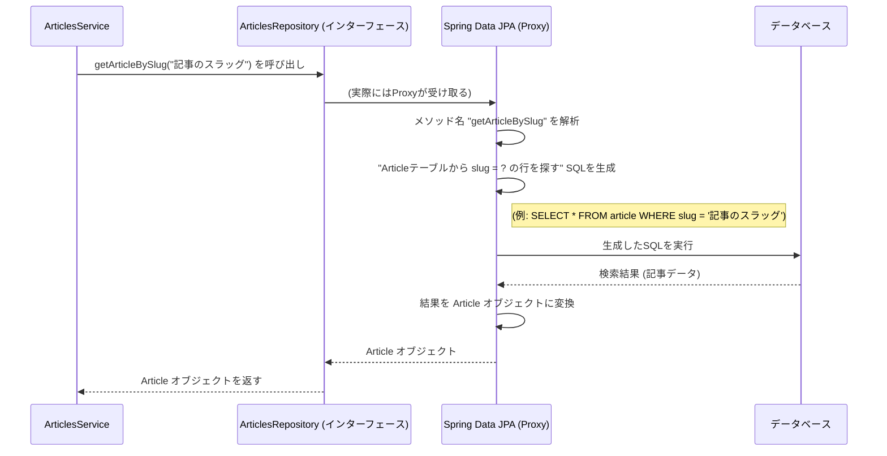

# Chapter 4: データアクセス層 (データアクセスそう)

前の章、[記事管理 (きじかんり)](03_記事管理.md)では、アプリケーションの中心的な機能である記事の作成、取得、更新、削除、そしてコメントやお気に入りといった関連機能について学びました。これらの機能を実現するためには、アプリケーションが記事やユーザーの情報、フォロー関係などを「どこかに保存」し、必要な時に「取り出す」必要があります。この「どこか」がデータベースであり、そのデータベースとのやり取りを専門に担当するのが、この章で学ぶ「データアクセス層」です。

## データベースとのやり取りをシンプルに

想像してみてください。あなたが図書館で特定の本（例えば、「ドラゴン訓練法」という記事）を探したいとします。図書館には膨大な数の本（データ）があります。もし自分で書庫（データベース）に入り、複雑な分類ルール（SQLクエリ）を駆使して本を探さなければならないとしたら、大変ですよね？

データアクセス層は、この大変な作業を肩代わりしてくれる存在です。まるで、親切な図書館の司書さんのようです。

**データアクセス層の役割:**

*   **データベースとの対話を隠す（抽象化）**: アプリケーションの他の部分（サービス層など）は、データベースの細かい仕組みや、SQLという特別な言語を知らなくても、データの保存や取得ができるようになります。
*   **データの永続化**: データの保存 (Create)、読み込み (Read)、更新 (Update)、削除 (Delete) - いわゆるCRUD操作を担当します。
*   **一貫性の提供**: アプリケーション全体で、データベースへのアクセス方法を統一します。

このプロジェクトでは、このデータアクセス層を実現するために **Spring Data JPA** という強力なツールを使っています。

## Spring Data JPA と Repositoryインターフェース

Spring Data JPAは、Javaアプリケーションでデータベースを扱うためのフレームワーク（便利な道具箱）です。特に、「**Repository（リポジトリ）**」というパターンを使うことで、データベース操作を驚くほど簡単にします。

**Repositoryインターフェースとは？**

これは、特定の種類のデータ（例えば `Article` や `Follow`）に対するデータベース操作の「窓口」となるインターフェース（約束事のリスト）です。

イメージとしては、各データ専門の司書さんです。

*   `ArticlesRepository`: 記事専門の司書さん。記事の検索、保存、削除などを担当。
*   `FollowsRepository`: フォロー関係専門の司書さん。フォロー情報の確認、追加、削除を担当。
*   `TagsRepository`: タグ専門の司書さん。

これらの司書さん（Repository）にお願いするだけで、彼らが裏側で書庫（データベース）とやり取りしてくれます。私たちは、難しいSQLを書く必要がほとんどありません。

### Repositoryインターフェースの定義例 (`ArticlesRepository`)

実際に `ArticlesRepository` がどのように定義されているか見てみましょう。

```java
// src/main/java/com/marcusmonteirodesouza/realworld/api/articles/repositories/articles/ArticlesRepository.java
package com.marcusmonteirodesouza.realworld.api.articles.repositories.articles;

import com.marcusmonteirodesouza.realworld.api.articles.models.Article; // Articleモデルをインポート
import org.springframework.data.jpa.repository.JpaRepository; // Spring Data JPAの基本機能をインポート
import org.springframework.data.jpa.repository.JpaSpecificationExecutor; // 高度な検索機能用

// JpaRepository<管理するデータ型, そのデータのIDの型> を継承
public interface ArticlesRepository
        extends JpaRepository<Article, String>, JpaSpecificationExecutor<Article> {
    // メソッド名を定義するだけで、Spring Data JPAが実装を自動生成してくれる！
    public Article getArticleBySlug(String slug);
}
```

*   `interface ArticlesRepository`: `ArticlesRepository` という名前のインターフェースを定義しています。
*   `extends JpaRepository<Article, String>`: ここが重要です！`JpaRepository` を継承することで、基本的なデータベース操作（`save`, `findById`, `findAll`, `delete` など）の機能が自動的に使えるようになります。`<Article, String>` は、このリポジトリが `Article` モデル（データ型）を扱い、そのIDの型が `String` であることを示しています。
*   `public Article getArticleBySlug(String slug);`: これが「カスタム検索メソッド」です。メソッド名を特定のルール（`findBy...` や `getBy...` など）に従って定義するだけで、Spring Data JPAがメソッド名から判断して、適切なSQLクエリを自動生成し、実装してくれます。この例では、「`slug` というフィールドの値で `Article` を検索する」というメソッドになります。

`FollowsRepository` や `TagsRepository` も同様に定義されています。

```java
// src/main/java/com/marcusmonteirodesouza/realworld/api/profiles/repositories/FollowsRepository.java
public interface FollowsRepository extends JpaRepository<Follow, String> {
    // followerId と followedId でフォローが存在するかチェック
    Boolean existsByFollowerIdAndFollowedId(String followerId, String followedId);

    // followerId でフォロー情報を削除
    void deleteByFollowerIdAndFollowedId(String followerId, String followedId);
}
```

```java
// src/main/java/com/marcusmonteirodesouza/realworld/api/articles/repositories/tags/TagsRepository.java
public interface TagsRepository extends JpaRepository<Tag, String> {
    // value フィールドで Tag を検索 (Optionalは結果がない可能性を示す)
    Optional<Tag> findByValue(String value);
}
```

これらのインターフェースを定義するだけで、データベースとのやり取りの準備が整います。

## Repository の使い方

では、前の章で見た `ArticlesService` が、どのように `ArticlesRepository` を使って記事データを取得しているか見てみましょう。

**ユースケース:** `slug` を使って特定の記事を取得する。

```java
// src/main/java/com/marcusmonteirodesouza/realworld/api/articles/services/ArticlesService.java
@Service
public class ArticlesService {
    // ArticlesRepository を使うことを宣言 (Springが自動的にインスタンスを注入)
    private final ArticlesRepository articlesRepository;
    // ... 他の Repository や Service ...

    // コンストラクタで初期化
    public ArticlesService(ArticlesRepository articlesRepository, /* ... */) {
        this.articlesRepository = articlesRepository;
        // ...
    }

    // slug から記事を取得するメソッド
    public Optional<Article> getArticleBySlug(String slug) {
        // Repositoryのメソッドを呼び出すだけ！
        // SQLを書く必要はない
        return Optional.ofNullable(articlesRepository.getArticleBySlug(slug));
    }

    // ... 他のメソッド (createArticle, favoriteArticle など) ...
}
```

1.  `private final ArticlesRepository articlesRepository;`: `ArticlesService` クラス内で `ArticlesRepository` を使うことを宣言します。
2.  `public ArticlesService(ArticlesRepository articlesRepository, ...)`: コンストラクタを通じて、Springフレームワークが `ArticlesRepository` の「実装」（実際にはSpring Data JPAが裏で自動生成したもの）をこのクラスに注入（提供）してくれます。
3.  `articlesRepository.getArticleBySlug(slug)`: 実際に記事を取得したい場面で、`ArticlesRepository` に定義した `getArticleBySlug` メソッドを呼び出すだけです。まるで司書さんに「この整理番号（slug）の本を探してきて」と頼むようなものです。

`createArticle` メソッド内では `articlesRepository.saveAndFlush(article)` を呼び出して記事を保存し、`favoriteArticle` メソッド内では `articlesRepository.saveAndFlush(article)` を呼び出して（お気に入り情報が追加された）記事を更新します。これも `JpaRepository` から継承されたメソッドです。

このように、Repositoryインターフェースを使うことで、サービス層（`ArticlesService` など）は、データベースアクセスの詳細を知ることなく、宣言的なメソッド呼び出しによってデータを操作できます。

## 舞台裏: Repository はどう動く？

インターフェース（約束事のリスト）を定義しただけで、なぜデータベース操作ができるのでしょうか？Spring Data JPA が魔法を使っているのです。

アプリケーションが起動すると、Spring Data JPA は `JpaRepository` を継承したインターフェース（`ArticlesRepository` など）を見つけます。そして、そのインターフェースの「代理（Proxy）」となる実装クラスを**自動的に生成**します。

**処理の流れ (getArticleBySlug の例):**



1.  **ArticlesService** が `articlesRepository.getArticleBySlug("...")` を呼び出します。
2.  実際には、この呼び出しは Spring Data JPA が生成した **Proxy オブジェクト** が受け取ります。
3.  Proxy オブジェクトは、呼び出されたメソッド名 (`getArticleBySlug`) を解析します。
4.  メソッド名の規則（`getBy...`、フィールド名`Slug`）から、実行すべきデータベース操作（特定の `slug` を持つ `Article` を検索）を判断し、対応する **SQL クエリを自動生成**します。
5.  生成された SQL を**データベース**に送信して実行します。
6.  データベースから返された結果を受け取ります。
7.  結果を `Article` クラスのオブジェクトに変換（マッピング）します。
8.  変換された `Article` オブジェクトを `ArticlesService` に返します。

このように、Spring Data JPA と Repository インターフェースが、面倒な SQL の作成やデータベースとの低レベルなやり取りをすべて隠蔽し、開発者がビジネスロジックに集中できるようにしてくれます。

## まとめ

この章では、アプリケーションがデータを永続化（保存・読み込み）するための「データアクセス層」について学びました。

*   データアクセス層は、データベースとのやり取りを**抽象化**し、アプリケーションの他の部分からデータベースの詳細を隠蔽します。図書館の司書さんのような役割です。
*   このプロジェクトでは、**Spring Data JPA** と **Repositoryインターフェース** を使ってデータアクセス層を実装しています。
*   `JpaRepository` を継承してインターフェース (`ArticlesRepository`, `FollowsRepository` など) を定義するだけで、基本的な CRUD 操作が可能になります。
*   メソッド名を特定の規則に従って定義することで、**カスタム検索**も SQL を書かずに実現できます (`getArticleBySlug` など)。
*   Spring Data JPA が**実行時にインターフェースの実装を自動生成**し、メソッド名から判断して SQL を発行してくれます。

これにより、開発者はデータベースアクセスのための定型的なコード（ボイラープレートコード）を書く手間から解放され、よりアプリケーションの本質的な機能開発に集中できます。

次の章、[APIリクエスト処理 (APIリクエストしょり)](05_apiリクエスト処理__apiリクエストしょり__.md)では、ユーザーからのリクエスト（HTTPリクエスト）をどのように受け取り、解釈し、今回学んだデータアクセス層やサービス層を呼び出して応答を返すのか、その入り口となる部分について詳しく見ていきます。

---

Generated by [AI Codebase Knowledge Builder](https://github.com/The-Pocket/Tutorial-Codebase-Knowledge)