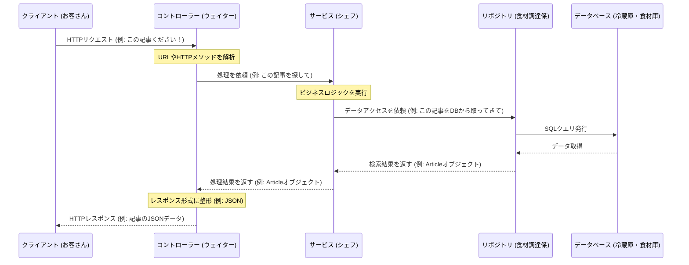

# Chapter 5: APIリクエスト処理 (APIリクエストしょり)

前の章、[データアクセス層 (データアクセスそう)](04_データアクセス層.md)では、アプリケーションがデータベースとどのように情報をやり取りするのか、特に Spring Data JPA と Repository インターフェースの役割について学びました。データベースからデータを読み書きする準備はできましたが、そもそも、ユーザーからの「この記事が見たい！」「新しいユーザーを登録したい！」といったリクエストは、アプリケーションのどこが最初に受け取るのでしょうか？

この章では、その入り口となる「APIリクエスト処理」について学びます。これは、外部（主にウェブブラウザやスマートフォンアプリなどのフロントエンド）からのHTTPリクエストを受け取り、適切な処理を行い、結果を返すという、アプリケーションの「受付係」のような役割です。

## APIリクエスト処理ってなに？ レストランのウェイターさん

APIリクエスト処理は、外部からのHTTPリクエストを受け取り、その内容に応じて適切なビジネスロジック（これは[サービス層](03_記事管理__きじかんり__.md)が担当します）を呼び出し、処理結果を整形してHTTPレスポンスとして返す役割を担います。

これをレストランに例えてみましょう。

*   **お客さん (クライアント)**: フロントエンド（例: ブラウザ）です。料理を注文したい人。
*   **注文 (HTTPリクエスト)**: 「このステーキをください」「今日のパスタは何ですか？」といった具体的な要望。
*   **ウェイター (コントローラー/APIリクエスト処理)**: あなたの注文を受け取り、厨房に伝えます。
*   **厨房のシェフ (サービス層)**: 実際に料理を作る人。ビジネスロジックを担当。
*   **食材調達 (リポジトリ層)**: 必要な食材（データ）を冷蔵庫（データベース）から取ってくる人。
*   **出来上がった料理 (HTTPレスポンス)**: シェフが作った料理。ウェイターがあなたに届けます。

このプロジェクトでは、この「ウェイター」の役割を担うのが「**コントローラー (Controller)**」と呼ばれるクラスです。ユーザー管理、プロフィール管理、記事管理といった各機能ごとに、専門のコントローラークラスが存在します。

*   `UsersController.java`: ユーザー登録、ログイン、ユーザー情報取得などのリクエストを処理。
*   `ProfilesController.java`: プロフィール表示、フォロー/アンフォローなどのリクエストを処理。
*   `ArticlesController.java`: 記事の作成、取得、更新、削除、コメント投稿などのリクエストを処理。
*   `TagsController.java`: タグ一覧取得のリクエストを処理。

これらのコントローラーが、アプリケーションの最初の窓口となり、さまざまなリクエストに対応します。

## コントローラーの仕事：リクエストを受け取り、サービスへ繋ぐ

コントローラーの主な仕事は以下の通りです。

1.  **リクエストの受付**: 特定のURLパス（例: `/articles/{slug}`）とHTTPメソッド（例: `GET`, `POST`）のリクエストを受け取ります。
2.  **情報抽出**: リクエストから必要な情報（URLの一部、送られてきたデータ、URLのパラメータなど）を取り出します。
3.  **サービス呼び出し**: 取り出した情報を使って、対応するサービスクラスのメソッドを呼び出し、実際の処理を依頼します。（コントローラー自身は複雑なビジネスロ 考えません。）
4.  **レスポンスの準備と返却**: サービスから受け取った結果を、クライアントが理解しやすい形（通常はJSON形式）に整形し、HTTPレスポンスとして返します。

### 具体例：記事を取得するリクエスト (`GET /articles/{slug}`)

ユーザーが特定の記事を読みたいとき、フロントエンドは例えば `GET /articles/how-to-train-your-dragon` のようなリクエストを送信します。このリクエストは `ArticlesController` が受け取ります。

```java
// src/main/java/com/marcusmonteirodesouza/realworld/api/articles/controllers/ArticlesController.java
@RestController // (1) このクラスがAPIリクエストを処理することを示す
@RequestMapping(path = "/articles") // (2) "/articles" で始まるリクエストをこのコントローラーが担当
public class ArticlesController {
    // ... (必要なサービスや認証部品) ...
    private final ArticlesService articlesService;
    private final ProfilesService profilesService;
    private final IAuthenticationFacade authenticationFacade;

    // コンストラクタで依存性を注入
    public ArticlesController(
            IAuthenticationFacade authenticationFacade,
            ArticlesService articlesService,
            /* ... */) {
        this.authenticationFacade = authenticationFacade;
        this.articlesService = articlesService;
        // ...
    }

    @GetMapping("/{slug}") // (3) GETメソッドで "/articles/{slug}" の形のURLに対応
    public ArticleResponse getArticle(@PathVariable String slug) { // (4) URLの{slug}部分を取得
        var maybeUserId = Optional.ofNullable(authenticationFacade.getAuthentication().getName()); // ログインユーザーID取得

        // (5) ArticlesService に記事取得を依頼
        var article = articlesService.getArticleBySlug(slug).orElse(null);

        if (article == null) {
            throw new NotFoundException("Article with slug '" + slug + "' not found"); // 見つからなければエラー
        }

        // (6) 著者のプロフィール情報を ProfilesService から取得
        var authorProfile = profilesService.getProfile(article.getAuthorId(), maybeUserId);

        // (7) 結果を ArticleResponse に詰めて返す (SpringがJSONに変換)
        return new ArticleResponse(maybeUserId, article, authorProfile);
    }
    // ... 他のメソッド ...
}
```

このコードの流れを見てみましょう。

1.  `@RestController`: このクラスがHTTPリクエストを受け付ける特別なコンポーネント（コントローラー）であることをSpringフレームワークに伝えます。
2.  `@RequestMapping(path = "/articles")`: `ArticlesController` クラス全体が `/articles` で始まるURLパスのリクエストを担当することを示します。
3.  `@GetMapping("/{slug}")`: `getArticle` メソッドが、HTTPの `GET` メソッドで、かつ `/articles/` の後に何らかの文字列 (`{slug}`) が続くURL（例: `/articles/how-to-train-your-dragon`）のリクエストを処理することを示します。
4.  `@PathVariable String slug`: URLの `{slug}` の部分を、メソッドの引数 `slug` として受け取ります。これにより、`how-to-train-your-dragon` という文字列が `slug` 変数に入ります。
5.  `articlesService.getArticleBySlug(slug)`: 以前の章で学んだ `ArticlesService` のメソッドを呼び出し、実際の記事検索処理を依頼します。コントローラーは「どうやって記事を探すか」は知りません。それはサービスのお仕事です。
6.  `profilesService.getProfile(...)`: 同様に、記事の著者情報を取得するために `ProfilesService` を呼び出します。
7.  `return new ArticleResponse(...)`: サービスから受け取った記事情報と著者情報を `ArticleResponse` という専用のオブジェクトに詰めて返します。Springフレームワークが、このオブジェクトを自動的にJSON形式のデータに変換し、HTTPレスポンスとしてクライアントに送信します。

このように、コントローラーはリクエストの「交通整理」を行い、適切なサービスに処理を委任し、最終的な結果をクライアントに返す役割を担います。

### 様々なリクエスト情報の受け取り方

コントローラーは、`@PathVariable` 以外にも様々な方法でリクエスト情報を受け取ることができます。

*   **`@RequestBody`**: `POST` や `PUT` リクエストで送信されるデータ（通常はJSON形式）をJavaオブジェクトに変換して受け取ります。例えば、新しい記事を作成する際には、記事のタイトルや本文がJSONで送られてきます。
    ```java
    // src/main/java/com/marcusmonteirodesouza/realworld/api/articles/controllers/ArticlesController.java
    @PostMapping() // POST /articles へのリクエスト
    @ResponseStatus(HttpStatus.CREATED) // 成功時は 201 Created を返す
    public ArticleResponse createArticle(@RequestBody CreateArticleRequest request) { // JSONデータを request オブジェクトに
        // ... 記事作成処理 ...
        var article = articlesService.createArticle(/* request.article の情報を使用 */);
        // ... レスポンス作成 ...
        return new ArticleResponse(/* ... */);
    }
    ```
    `CreateArticleRequest` は、リクエストとして送られてくるJSONの構造に対応したJavaクラスです。

*   **`@RequestParam`**: URLのクエリパラメータ（例: `/articles?tag=java&limit=10` の `tag` や `limit`）を受け取ります。
    ```java
    // src/main/java/com/marcusmonteirodesouza/realworld/api/articles/controllers/ArticlesController.java
    @GetMapping() // GET /articles へのリクエスト
    public MultipleArticlesResponse listArticles(
            @RequestParam(required = false) String tag,    // "?tag=..." (任意)
            @RequestParam(defaultValue = "20") Integer limit) { // "?limit=..." (デフォルト20)
        // ... tag や limit を使って記事一覧を取得する処理 ...
        var articles = articlesService.listArticles(/* tag, limit を使用 */);
        // ... レスポンス作成 ...
        return new MultipleArticlesResponse(/* ... */);
    }
    ```

*   **`@RequestHeader`**: リクエストヘッダーの値（例: `Authorization` ヘッダーに含まれる認証トークン）を受け取ります。
    ```java
    // src/main/java/com/marcusmonteirodesouza/realworld/api/users/controllers/UsersController.java
    @GetMapping("/user") // GET /user へのリクエスト
    public UserResponse getCurrentUser(
            @RequestHeader(name = "Authorization") String authorizationHeader) { // Authorizationヘッダーを取得
        // ... authorizationHeader (トークン) を使ってユーザー情報を取得 ...
        var token = authorizationHeader.split(" ")[1]; // "Token ..." から実際のトークンを抽出
        // ...
        return new UserResponse(/* ... */);
    }
    ```

これらのアノテーション（`@` で始まる印）を適切に使うことで、コントローラーは外部からの様々な形式のリクエストをスマートに処理できます。

## リクエスト処理の全体像

クライアントからのリクエストがコントローラーに届き、サービス、リポジトリを経て、レスポンスが返されるまでの流れを視覚的に見てみましょう。これは、レストランで注文してから料理が出てくるまでの流れに似ています。



1.  **クライアント**がHTTPリクエストを送信します。
2.  **コントローラー**がリクエストを受け取り、どのメソッドで処理すべきかを判断します。リクエストから必要な情報（パス変数、リクエストボディなど）を抽出します。
3.  **コントローラー**は、抽出した情報を使って、適切な**サービス**のメソッドを呼び出します。
4.  **サービス**は、ビジネスロジックを実行します。必要であれば、**リポジトリ**を呼び出してデータベースからデータを取得したり、データを保存したりします。（リポジトリについては[データアクセス層 (データアクセスそう)](04_データアクセス層__データアクセスそう__.md)で学びましたね。）
5.  **リポジトリ**が**データベース**とやり取りし、結果をサービスに返します。
6.  **サービス**が処理結果を**コントローラー**に返します。
7.  **コントローラー**は、サービスから受け取った結果をHTTPレスポンス（通常はJSON）に変換し、**クライアント**に返します。

この一連の流れの中で、コントローラーはあくまで「受付」と「指示出し」、そして「結果の伝達」に徹し、複雑な処理はサービス層に任せるのが良い設計とされています。

## まとめ

この章では、APIリクエスト処理の主役である「コントローラー」について学びました。

*   コントローラーは、外部からのHTTPリクエストを最初に受け取る**アプリケーションの窓口**です。レストランのウェイターのような役割をします。
*   主な仕事は、リクエストの内容を解釈し、適切な**サービス**を呼び出し、その結果を整形してクライアントに**レスポンス**として返すことです。
*   `UsersController`, `ProfilesController`, `ArticlesController` など、機能ごとに専用のコントローラーが存在します。
*   `@RestController`, `@RequestMapping`, `@GetMapping`, `@PostMapping`, `@PathVariable`, `@RequestBody`, `@RequestParam` などのアノテーションを使って、リクエストのルーティングやパラメータの受け取りを行います。
*   コントローラー自身はビジネスロジックを持たず、サービス層に処理を委任します。

これで、クライアントからのリクエストがどのようにアプリケーションに受け入れられ、処理が開始されるのかが理解できたはずです。コントローラーは、アプリケーションの機能と外部の世界を繋ぐ、非常に重要な役割を果たしています。

次の章、[セキュリティ設定 (セキュリティせってい)](06_セキュリティ設定__セキュリティせってい__.md)では、誰がどのAPIにアクセスできるのか、といったセキュリティに関する設定がどのように行われているのかを詳しく見ていきます。コントローラーが受け付けるリクエストの中には、認証が必要なものも多くありますからね。

---

Generated by [AI Codebase Knowledge Builder](https://github.com/The-Pocket/Tutorial-Codebase-Knowledge)