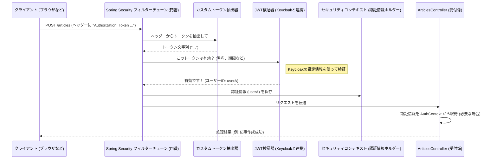

# Chapter 6: セキュリティ設定 (セキュリティせってい)

前の章、[APIリクエスト処理 (APIリクエストしょり)](05_apiリクエスト処理.md)では、ユーザーからのリクエストがどのようにコントローラーに受け取られ、処理が開始されるかを学びました。コントローラーはアプリケーションの窓口ですが、すべてのリクエストを誰にでも受け入れて良いわけではありません。例えば、記事の投稿やプロフィールの更新は、ログインしている本人しかできないようにする必要があります。

この章では、アプリケーション全体の「警備員」の役割を果たす「セキュリティ設定」について学びます。どのドア（APIエンドポイント）に鍵をかけるか、誰にどの鍵（アクセス権）を渡すかを設定する、いわば建物のセキュリティシステムの設定画面のようなものです。

## セキュリティ設定ってなに？ なぜ必要？

ウェブアプリケーションでは、誰でもアクセスできる公開情報（例：公開記事の一覧）と、特定のユーザーだけがアクセスできる機能（例：記事の投稿、ユーザー情報の更新）があります。セキュリティ設定は、これらのアクセスルールを定義し、不正なアクセスからアプリケーションを守るために不可欠です。

もしセキュリティ設定がなければ、誰でも他のユーザーになりすまして記事を削除したり、個人情報を書き換えたりできてしまいます。これは絶対に避けなければなりません。

このプロジェクトでは、**Spring Security** というフレームワークを使って、これらのセキュリティルールを管理しています。Spring Security は、アプリケーションの「門番」として、入ってくるリクエストをチェックし、許可されたものだけを通します。

**主な役割:**

1.  **認証 (Authentication)**: 「あなたは誰ですか？」を確認するプロセス。ユーザーIDとパスワードを検証したり、提示されたトークン（身分証明書）が有効か確認したりします。私たちのプロジェクトでは、この認証処理の多くを [ユーザー管理と認証 (ユーザーかんりと にんしょう)](01_ユーザー管理と認証__ユーザーかんりと_にんしょう__.md) で学んだ **Keycloak** が担当します。
2.  **認可 (Authorization)**: 「あなたは何をする権限がありますか？」を判断するプロセス。認証されたユーザーが、特定のリソース（例：特定のAPIエンドポイント）にアクセスする権限を持っているかを確認します。

この章では、Spring Security を使って、どのAPIエンドポイントが公開され、どれが認証を必要とするかを設定する方法を見ていきます。

## 設定の場所: `SecurityConfig.java`

アプリケーションのセキュリティルールは、主に `src/main/java/com/marcusmonteirodesouza/realworld/api/security/SecurityConfig.java` というファイルで設定されています。このファイルが、Spring Security の設定の中心地です。

```java
// src/main/java/com/marcusmonteirodesouza/realworld/api/security/SecurityConfig.java
package com.marcusmonteirodesouza.realworld.api.security;

// 必要なクラスをインポート
import org.springframework.context.annotation.Bean;
import org.springframework.context.annotation.Configuration;
import org.springframework.http.HttpHeaders;
import org.springframework.http.HttpMethod;
import org.springframework.security.config.Customizer;
import org.springframework.security.config.annotation.web.builders.HttpSecurity;
import org.springframework.security.config.annotation.web.configuration.EnableWebSecurity;
import org.springframework.security.config.http.SessionCreationPolicy;
import org.springframework.security.web.SecurityFilterChain;

@Configuration // (1) これが設定用のクラスであることを示す
@EnableWebSecurity // (2) Spring Security のウェブセキュリティ機能を有効にする
public class SecurityConfig {

    @Bean // (3) Springが管理する設定部品（Bean）を定義
    public SecurityFilterChain securityFilterChain(HttpSecurity http) throws Exception {
        // (4) CSRF保護を無効化 (ステートレスなAPIでは一般的)
        http.csrf(csrfCustomizer -> csrfCustomizer.disable())
                // (5) HTTPリクエストに対する認可ルールを設定
                .authorizeHttpRequests(
                        authorizeHttpRequests ->
                                authorizeHttpRequests
                                        // (6) 特定のパスへのリクエストは誰でも許可 (permitAll)
                                        .requestMatchers(HttpMethod.POST, "/users") // ユーザー登録
                                        .permitAll()
                                        .requestMatchers(HttpMethod.POST, "/users/login") // ログイン
                                        .permitAll()
                                        .requestMatchers(HttpMethod.GET, "/profiles/*") // プロフィール取得
                                        .permitAll()
                                        .requestMatchers(HttpMethod.GET, "/articles") // 記事一覧
                                        .permitAll()
                                        .requestMatchers(HttpMethod.GET, "/articles/*") // 個別記事取得
                                        .permitAll()
                                        .requestMatchers(HttpMethod.GET, "/articles/*/comments") // コメント取得
                                        .permitAll()
                                        .requestMatchers(HttpMethod.GET, "/tags") // タグ一覧
                                        .permitAll()
                                        // (7) 上記以外、すべてのリクエストは認証が必要 (authenticated)
                                        .anyRequest()
                                        .authenticated());

        // (8) セッション管理: ステートレス (セッションを使わない) に設定
        http.sessionManagement(
                sessionManagementCustomizer ->
                        sessionManagementCustomizer.sessionCreationPolicy(
                                SessionCreationPolicy.STATELESS));

        // (9) OAuth2/JWT トークン認証の設定
        http.oauth2ResourceServer(
                oauth2ResourceServerCustomizer ->
                        oauth2ResourceServerCustomizer
                                // (10) "Token <token>" 形式ヘッダーからトークンを抽出する設定
                                .bearerTokenResolver(
                                        httpServletRequest -> {
                                            var header =
                                                    httpServletRequest.getHeader(
                                                            HttpHeaders.AUTHORIZATION);

                                            // ヘッダーがない、または形式が違う場合は null を返す
                                            if (header == null || header.isBlank() || !header.startsWith("Token ")) {
                                                return null; // この場合、認証なしとみなされる
                                            }

                                            // "Token " の部分を取り除き、実際のトークン文字列を返す
                                            var token = header.split("Token ")[1].trim();
                                            return token;
                                        })
                                // (11) JWT の検証設定 (Keycloakと連携)
                                .jwt(Customizer.withDefaults()));

        // (12) 設定を構築して返す
        return http.build();
    }
}
```

この設定ファイルで行われていることを、ステップごとに見ていきましょう。

1.  `@Configuration`: このクラスがSpringの設定情報を持っていることを示します。
2.  `@EnableWebSecurity`: Spring Security を有効にし、ウェブアプリケーション向けのセキュリティ設定を行えるようにします。
3.  `@Bean public SecurityFilterChain securityFilterChain(...)`: ここで、具体的なセキュリティルール（フィルタチェーン）を定義します。`HttpSecurity` オブジェクトを使って、ルールを組み立てていきます。
4.  `http.csrf(csrf -> csrf.disable())`: CSRF（クロスサイトリクエストフォージェリ）という種類の攻撃を防ぐ機能ですが、JWTトークンを使うようなステートレスなAPIでは、通常は無効にします。
5.  `.authorizeHttpRequests(...)`: ここからが、どのリクエストを許可し、どれに認証を要求するかの設定です。
6.  `.requestMatchers(HttpMethod.XXX, "/path/to/endpoint").permitAll()`: 指定されたHTTPメソッドとURLパスの組み合わせに対するリクエストは、認証なしで誰でもアクセスできる (`permitAll`) ように設定します。ユーザー登録 (`POST /users`)、ログイン (`POST /users/login`)、公開記事の閲覧 (`GET /articles`) などがこれに該当します。
7.  `.anyRequest().authenticated()`: 上記の `permitAll` で許可されたパス以外、**すべてのリクエスト** (`anyRequest`) は、**認証が必要** (`authenticated`) であることを示します。つまり、記事の投稿 (`POST /articles`) やユーザー情報の更新 (`PUT /user`) などを行うには、有効なトークンを提示して認証される必要があります。
8.  `http.sessionManagement(...)`: セッション管理の方法を設定します。`SessionCreationPolicy.STATELESS` は、「セッションを使わない」設定です。JWTトークンを使う場合、サーバー側でユーザーの状態（セッション）を保持する必要がないため、この設定が適しています。リクエストごとにトークンで認証します。
9.  `http.oauth2ResourceServer(...)`: このアプリケーションがOAuth 2.0のリソースサーバー（保護されたリソースを提供するサーバー）として機能し、JWTトークンを使ってクライアントを認証するように設定します。
10. `.bearerTokenResolver(...)`: Spring Security はデフォルトで、リクエストヘッダーの `Authorization: Bearer <token>` という形式でトークンが送られてくることを期待します。しかし、Realworld の仕様では `Authorization: Token <token>` という形式なので、この部分で「`Token ` という接頭辞を取り除いてトークンを抽出する」というカスタムルールを定義しています。
11. `.jwt(Customizer.withDefaults())`: JWTトークンの検証方法を設定します。`Customizer.withDefaults()` は、`application.properties` ファイルなどに書かれた設定（特に `spring.security.oauth2.resourceserver.jwt.issuer-uri` などで指定されたKeycloakの情報）を使って、Keycloakが発行したJWTトークンが本物かどうか（署名の検証、有効期限の確認など）を検証するようにSpring Securityに指示します。
12. `return http.build()`: これまで設定したルールをまとめて、`SecurityFilterChain` オブジェクトとして構築し、Spring Security が利用できるようにします。

この `SecurityConfig.java` ファイルによって、アプリケーション全体のセキュリティポリシーが一元管理され、どのAPIが公開され、どれが保護されるかが明確に定義されます。

## 舞台裏: リクエストがセキュリティチェックを通過するまで

では、実際にユーザーが認証が必要なAPI（例えば、新しい記事を投稿する `POST /articles`）にリクエストを送ったとき、内部では何が起こっているのでしょうか？



1.  **クライアント**が、記事作成リクエストを `Authorization: Token <ユーザーのトークン>` ヘッダー付きで送信します。
2.  リクエストは、**コントローラー (`ArticlesController`) に到達する前**に、**Spring Security フィルターチェーン** (門番) に捕らえられます。
3.  フィルターチェーン内の認証フィルターが、設定された **カスタムトークン抽出器 (`bearerTokenResolver`)** を使って、ヘッダーから実際のトークン文字列を抜き出します。
4.  次に、**JWT検証器 (`jwt(Customizer.withDefaults())`)** が、`application.properties` の設定に基づいて Keycloak の公開鍵などを取得し、トークンの署名が正しいか、有効期限が切れていないかなどを**検証**します。
5.  トークンが**有効**であれば、Spring Security はそのトークンに含まれる情報（例：ユーザーID `userA`）を使って**認証情報 (`Authentication` オブジェクト)** を作成します。
6.  作成された認証情報は、**セキュリティコンテキスト (`SecurityContextHolder`)** という場所に保存されます。これで、このリクエストは「ユーザーAによって認証された」状態になります。
7.  `SecurityConfig` の `authorizeHttpRequests` ルール (`.anyRequest().authenticated()`) により、認証されたリクエストはアクセスが許可されるため、フィルターチェーンはリクエストを本来の宛先である **`ArticlesController`** に渡します。
8.  `ArticlesController` や、そこから呼び出される `ArticlesService` は、必要に応じて `IAuthenticationFacade` (内部で `SecurityContextHolder` を使う) を通じて、現在認証されているユーザーのID (`userA`) を取得し、記事の著者情報として利用できます。
9.  もし、トークンが無効だったり、トークンなしで認証が必要なエンドポイントにアクセスしようとした場合、ステップ4または7でフィルターチェーンがリクエストを**拒否**し、クライアントには通常 `401 Unauthorized` エラーが返されます。

このように、Spring Security がコントローラーの前段で「門番」として機能し、設定されたルールに従ってアクセス制御を行うことで、アプリケーションの安全性が保たれます。

### 認証情報の取得 (`AuthenticationFacade`)

他の章でも登場した `AuthenticationFacade` は、このSpring Securityの仕組みとアプリケーションコードを繋ぐ役割を担っています。

```java
// src/main/java/com/marcusmonteirodesouza/realworld/api/authentication/IAuthenticationFacade.java
package com.marcusmonteirodesouza.realworld.api.authentication;

import org.springframework.security.core.Authentication;

// 認証情報を取得するためのインターフェース
public interface IAuthenticationFacade {
    Authentication getAuthentication();
}
```

```java
// src/main/java/com/marcusmonteirodesouza/realworld/api/authentication/AuthenticationFacade.java
package com.marcusmonteirodesouza.realworld.api.authentication;

import org.springframework.security.core.Authentication;
import org.springframework.security.core.context.SecurityContextHolder; // これが重要！
import org.springframework.stereotype.Component;

@Component // Springのコンポーネントとして登録
public class AuthenticationFacade implements IAuthenticationFacade {
    @Override
    public Authentication getAuthentication() {
        // SecurityContextHolder から現在の認証情報を取得して返す
        return SecurityContextHolder.getContext().getAuthentication();
    }
}
```

コントローラーやサービスは、この `AuthenticationFacade` を使うことで、Spring Security がセキュリティコンテキストに保存した現在のリクエストの認証情報（ログインしているユーザーの情報など）を簡単に取得できます。

## まとめ

この章では、アプリケーションのセキュリティ設定について学びました。

*   セキュリティ設定は、誰がどのAPIエンドポイントにアクセスできるかを定義し、不正アクセスからアプリケーションを守るために不可欠です。
*   このプロジェクトでは **Spring Security** を利用してセキュリティを管理しています。
*   中心となる設定ファイルは `SecurityConfig.java` で、ここで**認証**と**認可**のルールを定義します。
*   `authorizeHttpRequests` で、`permitAll()` (誰でもアクセス可) や `authenticated()` (認証が必要) を使って、エンドポイントごとのアクセス権を設定します。
*   JWTトークンによる認証のために `oauth2ResourceServer` を設定し、Keycloak と連携してトークンの検証を行います。Realworld の仕様に合わせて `bearerTokenResolver` でトークンの抽出方法をカスタマイズしています。
*   Spring Security の**フィルターチェーン**が、リクエストがコントローラーに到達する前にセキュリティチェックを行います。
*   認証されたユーザーの情報は**セキュリティコンテキスト**に保存され、`AuthenticationFacade` を通じてアプリケーションコードからアクセスできます。

これで、アプリケーションがどのようにしてアクセスを制御し、安全性を確保しているかの基本的な仕組みが理解できたはずです。適切なセキュリティ設定は、信頼性の高いアプリケーションを構築するための基礎となります。

次の章、[例外処理 (れいがいしょり)](07_例外処理__れいがいしょり__.md)では、セキュリティチェックを通過したリクエストの処理中に予期せぬ問題（例えば、存在しないデータの要求、不正な入力値など）が発生した場合に、アプリケーションがどのようにそれらを検知し、適切に対応するかについて学びます。

---

Generated by [AI Codebase Knowledge Builder](https://github.com/The-Pocket/Tutorial-Codebase-Knowledge)