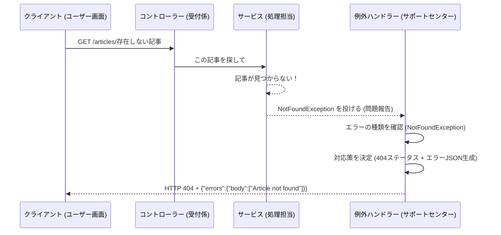

# Chapter 7: 例外処理 (れいがいしょり)

前の章、[セキュリティ設定 (セキュリティせってい)](06_セキュリティ設定.md)では、アプリケーションの入り口で「誰が」「何をして良いか」を管理するセキュリティの仕組みについて学びました。無事に認証・認可を通過したリクエストでも、処理を進める中で予期せぬ問題が発生することがあります。例えば、指定された記事が存在しなかったり、入力されたデータが不正だったりする場合です。

この章では、そうしたアプリケーション内部で起こる様々な「想定外の事態」＝「例外」に、どのようにスマートに対応するか、そのための「例外処理」という仕組みについて学びます。

## 例外処理ってなに？ 会社のカスタマーサポートセンター

アプリケーションを使っていると、色々なエラーに遭遇します。

*   「指定されたユーザーが見つかりません」 (Not Found)
*   「そのメールアドレスは既に使用されています」 (Already Exists / Conflict)
*   「この記事を削除する権限がありません」 (Forbidden)
*   「入力された数値が正しくありません」 (Bad Request / Unprocessable Entity)

もし、これらの問題が発生するたびにアプリケーションがクラッシュしたり、開発者向けの難しいエラーメッセージがユーザーにそのまま表示されたりしたら、とても使いにくいですよね。

「例外処理」は、このような様々な問題（例外）が発生した場合に、それらを一箇所で受け止め、状況に応じて**標準化された丁寧な方法**でクライアント（ユーザーが見ている画面など）に対応する仕組みです。

まるで、会社の**カスタマーサポートセンター**のようなものです。
お客様（クライアント）から様々な問い合わせやクレーム（エラー）が来たときに、マニュアル（エラー処理手順）に従って、状況に応じた適切な回答（エラーレスポンス）を返す役割を果たします。これにより、ユーザーは「何が起こったのか」を理解しやすくなり、アプリケーション全体の品質も向上します。

このプロジェクトでは、Springフレームワークの機能を使って、このカスタマーサポートセンターのような仕組みを構築しています。

## 例外処理の流れ： 問題発生から対応まで

アプリケーション内で問題が発生してから、クライアントにエラー情報が返されるまでの大まかな流れは以下のようになります。

1.  **問題発生（例外を投げる - Throw）**: アプリケーションのコード（例えば[サービス層](03_記事管理__きじかんり__.md)など）が処理を実行中に、「記事が見つからない」「権限がない」といった問題を発見します。この時、問題の種類に応じた「例外オブジェクト」（問題報告書のようなもの）を作成し、「投げます」。
2.  **問題をキャッチする（例外ハンドラー - Catch）**: 投げられた例外オブジェクトは、アプリケーション全体を監視している専門の部署（`@ControllerAdvice` が付いたクラス）に届けられます。そこには、様々な種類の例外に対応するための担当者（`@ExceptionHandler` が付いたメソッド）が待機しています。
3.  **決まった対応をする（レスポンス生成 - Respond）**: 例外を受け取った担当者は、その例外の種類（問題の種類）に応じて、事前に決められた対応を行います。具体的には、適切なHTTPステータスコード（例：見つからない場合は404 Not Found）と、エラー内容を分かりやすく記述したJSONデータを作成し、クライアントに返却します。



## 使い方： 実際に例外が発生した場合

例として、ユーザーが存在しない記事のスラッグ (`non-existent-slug`) を使って記事を取得しようとした場合を見てみましょう (`GET /articles/non-existent-slug`)。

1.  **コントローラー (`ArticlesController`)** はリクエストを受け取り、[サービス層](03_記事管理__きじかんり__.md)の `ArticlesService` に記事の取得を依頼します。
2.  **`ArticlesService`** はデータベースを検索しますが、該当する記事が見つかりません。ここで問題発生です。
3.  `ArticlesService` (またはそれを呼び出した `ArticlesController`) は、「見つからなかった」ことを示すために `NotFoundException` を投げます。

```java
// 例：ArticlesController.java 内 (簡略化)
@GetMapping("/{slug}")
public ArticleResponse getArticle(@PathVariable String slug) {
    // ... サービスを呼び出して記事を探す ...
    var article = articlesService.getArticleBySlug(slug).orElse(null);

    // もし記事が見つからなければ...
    if (article == null) {
        // 「見つからない」例外を投げる！
        throw new NotFoundException("Article with slug '" + slug + "' not found");
    }

    // ... (見つかった場合の処理) ...
}
```
*   `throw new NotFoundException(...)`: ここで問題報告書（`NotFoundException`）が投げられます。メッセージには、何が見つからなかったかの詳細を含めることができます。

4.  投げられた `NotFoundException` は、後述する **`RestResponseEntityExceptionHandler`** (カスタマーサポートセンター) によって捕捉されます。
5.  `RestResponseEntityExceptionHandler` は、これが `NotFoundException` であることを認識し、以下の対応を行います。
    *   HTTPステータスコードとして `404 Not Found` を選択します。
    *   エラーメッセージを含むJSONレスポンスを作成します。

**クライアントに返されるレスポンス:**

*   **HTTP Status:** `404 Not Found`
*   **Response Body (JSON):**
    ```json
    {
      "errors": {
        "body": [
          "Article with slug 'non-existent-slug' not found"
        ]
      }
    }
    ```

このように、クライアントはサーバー内部で何が起こったかを具体的に知る必要はなく、「指定した記事が見つからなかった」という明確な結果を受け取ることができます。

## 内部の仕組み: `@ControllerAdvice` と `@ExceptionHandler`

この便利な例外処理の仕組みは、主に `RestResponseEntityExceptionHandler.java` というクラスによって実現されています。

**`RestResponseEntityExceptionHandler.java` (サポートセンター):**

```java
// src/main/java/com/marcusmonteirodesouza/realworld/api/exceptionhandlers/RestResponseEntityExceptionHandler.java
package com.marcusmonteirodesouza.realworld.api.exceptionhandlers;

// 必要なクラスをインポート
import com.marcusmonteirodesouza.realworld.api.exceptionhandlers.dto.ErrorResponse;
import com.marcusmonteirodesouza.realworld.api.exceptions.*; // カスタム例外
import jakarta.ws.rs.NotFoundException; // JAX-RSのNotFoundException
import org.springframework.http.*; // HTTPステータスなど
import org.springframework.web.bind.annotation.ControllerAdvice; // これが重要！
import org.springframework.web.bind.annotation.ExceptionHandler; // これも重要！
import org.springframework.web.context.request.WebRequest;
import org.springframework.web.servlet.mvc.method.annotation.ResponseEntityExceptionHandler;

@ControllerAdvice // (1) アプリケーション全体のエラーを監視するクラス
public class RestResponseEntityExceptionHandler extends ResponseEntityExceptionHandler {

    // (2) すべての種類の例外を捕捉するメソッド (簡略化のため1つに集約)
    @ExceptionHandler(value = {Exception.class})
    protected ResponseEntity<Object> handleGeneralException(Exception ex, WebRequest request) {
        // ... (ログ出力など) ...

        ErrorResponse errorResponse; // 返却するエラー情報の入れ物
        HttpStatusCode statusCode; // 返却するHTTPステータスコード

        // (3) 発生した例外の種類に応じて、ステータスコードとエラーメッセージを決める
        if (ex instanceof NotFoundException) { // もし「見つからない」エラーなら
            errorResponse = new ErrorResponse(new String[] {ex.getMessage()});
            statusCode = HttpStatus.NOT_FOUND; // ステータスは 404 Not Found
        } else if (ex instanceof AlreadyExistsException) { // もし「既に存在する」エラーなら
            errorResponse = new ErrorResponse(new String[] {ex.getMessage()});
            statusCode = HttpStatus.CONFLICT; // ステータスは 409 Conflict
        } else if (ex instanceof ForbiddenException) { // もし「権限がない」エラーなら
            errorResponse = new ErrorResponse(new String[] {ex.getMessage()});
            statusCode = HttpStatus.FORBIDDEN; // ステータスは 403 Forbidden
        } else if (ex instanceof IllegalArgumentException) { // もし「不正な引数」エラーなら
            errorResponse = new ErrorResponse(new String[] {ex.getMessage()});
            statusCode = HttpStatus.UNPROCESSABLE_ENTITY; // 422 Unprocessable Entity
        }
        // ... 他のエラー種別に対する処理 ...
        else { // その他の予期せぬエラーの場合
            errorResponse = new ErrorResponse(new String[] {"Internal Server Error"});
            statusCode = HttpStatus.INTERNAL_SERVER_ERROR; // ステータスは 500
        }

        // (4) 決まった形式でエラーレスポンスを組み立てて返す
        return handleExceptionInternal(ex, errorResponse, new HttpHeaders(), statusCode, request);
    }
}
```

1.  `@ControllerAdvice`: このアノテーションが付いたクラスは、アプリケーション全体のコントローラーで発生した例外を横断的に捕捉し、処理することができます。まさに「サポートセンター」の役割です。
2.  `@ExceptionHandler(value = {Exception.class})`: このアノテーションが付いたメソッドは、指定された種類の例外（この例では `Exception.class` なので、あらゆる種類の例外）が発生したときに呼び出されます。特定の例外、例えば `@ExceptionHandler(NotFoundException.class)` のように指定することも可能です。
3.  `if (ex instanceof NotFoundException) ...`: `handleGeneralException` メソッドの中で、`instanceof` を使って実際に発生した例外 (`ex`) がどの種類かを判定しています。そして、例外の種類に応じて、返すエラーメッセージ (`ErrorResponse`) とHTTPステータスコード (`statusCode`) を決定しています。
4.  `return handleExceptionInternal(...)`: Springフレームワークが提供するメソッドを使って、決定したエラー情報とステータスコードを適切なHTTPレスポンス (`ResponseEntity`) として組み立て、クライアントに返却します。

**`ErrorResponse.java` (エラー報告書のフォーマット):**

エラーメッセージを、Realworld 仕様で定められたJSON形式 (`{"errors":{"body":[...]}}`) に整形するためのクラスです。

```java
// src/main/java/com/marcusmonteirodesouza/realworld/api/exceptionhandlers/dto/ErrorResponse.java
package com.marcusmonteirodesouza.realworld.api.exceptionhandlers.dto;

public class ErrorResponse {
    private ErrorResponseErrors errors; // "errors" というキーを持つ

    // コンストラクタ: エラーメッセージの配列を受け取る
    public ErrorResponse(String[] errors) {
        this.errors = new ErrorResponseErrors(errors);
    }

    public ErrorResponseErrors getErrors() { return errors; }

    // ネストされたクラス: "body" というキーでエラーメッセージ配列を持つ
    public class ErrorResponseErrors {
        private String[] body; // "body" キー

        public ErrorResponseErrors(String[] errors) {
            this.body = errors;
        }

        public String[] getBody() { return body; }
    }
}
```

このクラスを使うことで、`RestResponseEntityExceptionHandler` は簡単に仕様通りのJSONエラーレスポンスを生成できます。

**カスタム例外クラス:**

プロジェクト内には、特定の状況を示すためのカスタム例外クラスも定義されています。これにより、どのような問題が発生したのかをコード上でより明確に表現できます。

*   `AlreadyExistsException.java`: 何かが既に存在する場合（例：ユーザー登録時にメールアドレスが重複）。
*   `ForbiddenException.java`: アクセス権がない場合。

```java
// src/main/java/com/marcusmonteirodesouza/realworld/api/exceptions/AlreadyExistsException.java
package com.marcusmonteirodesouza.realworld.api.exceptions;

// Exceptionクラスを継承して独自の例外を定義
public class AlreadyExistsException extends Exception {
    public AlreadyExistsException(String message) {
        super(message); // エラーメッセージを受け取るコンストラクタ
    }
}
```

これらのカスタム例外も、`RestResponseEntityExceptionHandler` 内の `if-else` 文で適切に処理され、対応するHTTPステータスとエラーメッセージが返されます。

## まとめ

この章では、アプリケーション内で発生する様々なエラー（例外）に対応するための「例外処理」の仕組みについて学びました。

*   例外処理は、アプリケーションの**安定性**と**ユーザー体験**を向上させるために重要です。カスタマーサポートセンターのように、問題発生時に標準化された丁寧な対応を提供します。
*   問題が発生すると、コードは特定の**例外オブジェクト**を「投げ (throw)」ます。
*   `@ControllerAdvice` が付いたクラス (例: `RestResponseEntityExceptionHandler`) が、アプリケーション全体で投げられた例外を**監視**します。
*   `@ExceptionHandler` が付いたメソッドが、特定の種類の例外を**捕捉 (catch)** し、処理を担当します。
*   捕捉された例外の種類に応じて、適切な **HTTPステータスコード** と **JSON形式のエラーレスポンス** (`ErrorResponse` を使用) が生成され、クライアントに返却されます。
*   `NotFoundException`, `AlreadyExistsException`, `ForbiddenException` など、状況に応じた例外クラスを使用することで、エラーの種類を明確に示します。

この例外処理の仕組みにより、アプリケーションは予期せぬ問題が発生した場合でも、適切に状況を伝え、動作を継続することができます。

---

これで、Realworldバックエンドアプリケーションの主要な構成要素である、ユーザー管理、プロフィール、記事管理、データアクセス、APIリクエスト処理、セキュリティ、そして例外処理まで、一通りの機能とその仕組みを見てきました。

各章で学んだ知識を元に、ぜひ実際のコード全体をさらに深く探求してみてください。それぞれのコンポーネントがどのように連携し、Realworld アプリケーション全体がどのように動作しているのか、より深く理解できるはずです。このチュートリアルが、あなたの学習の一助となれば幸いです。

---

Generated by [AI Codebase Knowledge Builder](https://github.com/The-Pocket/Tutorial-Codebase-Knowledge)