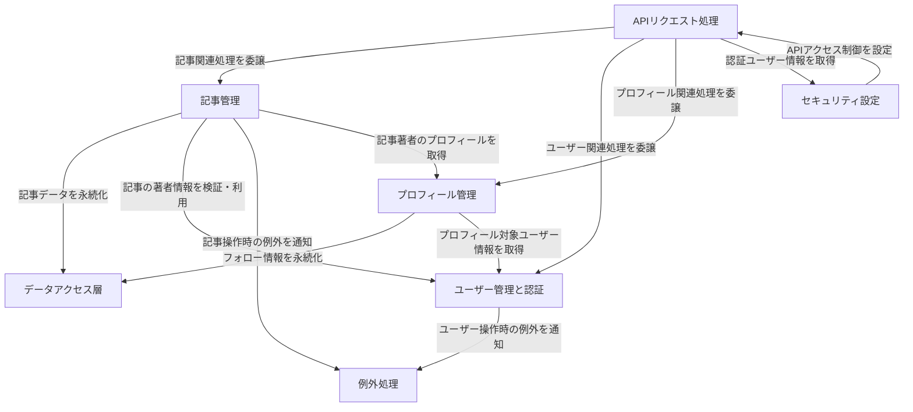

# Tutorial: realworld-backend-migration-demo-jp

このプロジェクトは、「*RealWorld*」という名前の**ブログ風アプリケーション**のバックエンドAPIです。
ユーザーは**記事**を投稿したり、コメントしたり、お気に入りに登録できます。
また、他のユーザーを**フォロー**したり、自分の**プロフィール**を編集したりすることも可能です。
認証には*Keycloak*という外部サービスが利用されています。

**Source Repository:** [None](None)

## Chapters

1. [ユーザー管理と認証](01_ユーザー管理と認証.md)
2. [プロフィール管理](02_プロフィール管理.md)
3. [記事管理](03_記事管理.md)
4. [データアクセス層](04_データアクセス層.md)
5. [APIリクエスト処理](05_apiリクエスト処理.md)
6. [セキュリティ設定](06_セキュリティ設定.md)
7. [例外処理](07_例外処理.md)

---

Generated by [AI Codebase Knowledge Builder](https://github.com/The-Pocket/Tutorial-Codebase-Knowledge)